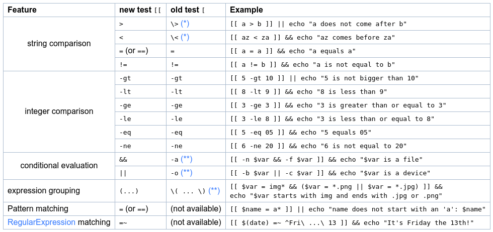

# Семинар №2
## Программирование командной строки

---

### 101

У компьютеров сейчас уже очень много интерфейсов работы, будь то полностью
графический, как в Windows, будь то уже голосовой, как у ассистентов. Но они
достаточно ограничены в своих действиях &mdash; мы пока не умеем голосом объяснять
любые команды или UX может быть ограниченным. Исторически так сложилось (и по
существу), что текстовые интерфейсы самые гибкие и намного проще для реализации.
Откуда появился старый добрый Shell.

Все платформы, которые Вы используете, имеют тот или иной shell. Сегодня мы
поговорим о самом популярном shell &mdash; Bourne Again SHell, или "bash" как его
ещё называют. Чтобы открыть терминал, который запустит Вам bash на Ubuntu,
надо ввести shortcut `Ctrl + Alt + T`, на MacOS нет дефолтного шортката, поэтому
надо через поиск или графический интерфейс. Если у Вас что-то другое, Вы уже
сами знаете, как открывать терминал.

Когда Вы открываете терминал с bash, у Вас перед глазами будет что-то похожее
на следующее:

```console
m.v.tsion@MacBook-Air-Mikhail :~$
```

Это основной текстовый интерфейс. Он показывает Вам, кто Вы, на какой машине, и
где Вы находитесь. Первый `m.v.tsion` &mdash; это кто я, второй `m.v.tsion` &mdash;
машина на которой я нахожусь. `~` &mdash; стандартное обозначение `home` директории
в Вашей системе, `$` обозначает, что Вы не root пользователь.

Дальше shell предоставляет Вам исполнять команды

```bash
m.v.tsion@MacBook-Air-Mikhail :~$ whoami
m.v.tsion
m.v.tsion@MacBook-Air-Mikhail :~$ hostname
m.v.tsion
```

Как они исполняются? Как и в языках программирования, в Shell есть глобальные
переменные, которые Вас окружают. В bash одна из основных глобальных переменных &mdash;
это `$PATH`. Ещё такие переменные называются переменными окружения. Чтобы их
вывести, надо обязательно перед ними поставить знак `$`, а команда `echo` умеет
выводить **аргументы командной строки**, причём `echo` ничего не знает про
`$PATH` &mdash; сам bash раскрывает эту переменную при исполнении.

```console
m.v.tsion@MacBook-Air-Mikhail :~$ echo PATH
PATH
m.v.tsion@MacBook-Air-Mikhail :~$ echo $PATH
/usr/local/sbin:/usr/local/bin:/usr/sbin:/usr/bin:/sbin:/bin
```

Теперь, когда Вы пишите любую команду, shell поочередно смотрит на все пути,
указанные в `$PATH`, и исполняет эту команду. Конфликты решаются по первому
попавшемуся пути в переменной. Например, у меня бинарный файл `whoami` на самом
деле лежит по `/usr/bin/whoami`. Вы можете это узнать, написав команду `which`.

```console
m.v.tsion@MacBook-Air-Mikhail :~$ which whoami
/usr/bin/whoami
m.v.tsion@MacBook-Air-Mikhail :~$ which which
/usr/bin/which
```

Вы также можете переопределять эти переменные перед командами, например:

```console
m.v.tsion@MacBook-Air-Mikhail :~$ PATH=/usr/local/bin whoami
bash: whoami: command not found
m.v.tsion@MacBook-Air-Mikhail :~$ PATH=/usr/bin whoami
m.v.tsion
```

С аргументами в shell есть сложности: основной разделитель является пробелом,
а иногда аргументы хочется иметь с пробелами. Для этого используют так
называемую технику escaping через обратный слеш `\`, а также кавычки.
Например, при навигации по директориям, если какая-то названа `mipt course`, то
её создавать или в неё входить можно так:

```console
m.v.tsion@MacBook-Air-Mikhail :~$ mkdir mipt\ course
m.v.tsion@MacBook-Air-Mikhail :~$ cd "mipt course"
m.v.tsion@MacBook-Air-Mikhail :~/mipt course$ pwd
/home/m.v.tsion/mipt course
m.v.tsion@MacBook-Air-Mikhail :~/mipt course$
```

Кавычки можно брать как и одинарные, так и двойные. И если Вам хочется какую-то
кавычку использовать в названии, то её можно окружить кавычками другого типа и
всё будет работать:

```console
m.v.tsion@MacBook-Air-Mikhail :~$ mkdir 'mipt\ "course'
m.v.tsion@MacBook-Air-Mikhail :~$ cd 'mipt\ "course'
m.v.tsion@MacBook-Air-Mikhail :~/mipt\ "course$
```

Кстати, про навигацию внутри файловой системы. В Linux системах всё находится
под одной точкой, называемой "root" или `/`. Все остальные файлы, девайсы
находятся под `/`. Основные команды для навигации:

```console
m.v.tsion@MacBook-Air-Mikhail :~$ pwd
/home/m.v.tsion
m.v.tsion@MacBook-Air-Mikhail :~$ cd /home
m.v.tsion@MacBook-Air-Mikhail :/home$ pwd
/home
m.v.tsion@MacBook-Air-Mikhail :/home$ cd ..
m.v.tsion@MacBook-Air-Mikhail :/$ pwd
/
m.v.tsion@MacBook-Air-Mikhail :/$ cd ./home
m.v.tsion@MacBook-Air-Mikhail :/home$ pwd
/home
m.v.tsion@MacBook-Air-Mikhail :/home$ cd m.v.tsion
m.v.tsion@MacBook-Air-Mikhail :~$ pwd
/home/m.v.tsion
m.v.tsion@MacBook-Air-Mikhail :~$ ../../bin/echo hello
hello
```

Путь, начинающийся с `/` &mdash; абсолютный путь, иначе он относительный. `.` &mdash; это
текущая директория, `..` &mdash; родительская директория (предыдущая до последнего
`/`), `pwd` &mdash; это команда print working directory.

Стоит отметить, что команда `cd -` вернёт Вас на предыдущую директорию, в
которой Вы были. Бывает полезно, когда Вы прыгаете между двумя директориями. А
`cd ~` вернёт Вас в Вашу home директорию.

Почти все команды работают с текущей директорией. Например, чтобы посмотреть,
что за файлы и папки находятся в текущей директории, достаточно запустить
команду `ls` &mdash; list.

```console
m.v.tsion@MacBook-Air-Mikhail :~$ ls
 -                                       Documents
 1_5zVzH8TuK1M-oxVnVEY1GA.png            Downloads
 2020-07-29-155724_1113x656_scrot.png    First
 2020-07-29-163555_1585x422_scrot.png    format-benchmark
...
```

### Аргументы

У команд как правило есть аргументы (или опции), это то, что вы пишете после
команды. Аргументы неформально делятся на два типа

* Позиционные. Например, `$ cd /etc`, вы передаёте команде `cd` аргумент, что
  надо пойти в директорию `/etc`.
* Опциональные. Это аргументы обычно начинаются с `-` или `--` (как их разделить не знаю, почти везде работает просто `-`). Пример: `$ ls -l` (см. ниже)

Аргументы позиционные и опциональные могут совмещаться

* `$ ls -d /etc`
* `$ ls -dl /etc`, пример, что однобуквенные аргументы в некоторых командах можно склеивать
* `$ ls --author -l .`, пример, когда можно совмещать много различных других аргументов

### Продолжение Shell

Чтобы посмотреть больше информации, у `ls` есть опция `-l`, вывод будет
более полным:

```console
m.v.tsion@MacBook-Air-Mikhail :~$ ls -l
total 250928
drwxr-xr-x  1 m.v.tsion staff    224044 May  4 13:11  dir_name
-rw-r-----  1 m.v.tsion staff    110021 Jul 29 15:45  1_5zVzH8TuK1M-oxVnVEY1GA.png
-rw-r-----  1 m.v.tsion staff    144485 Jul 29 15:57  2020-07-29-155724_1113x656_scrot.png
-rw-r-----  1 m.v.tsion staff     92167 Jul 29 16:35  2020-07-29-163555_1585x422_scrot.png
-rw-r-----  1 m.v.tsion staff     92031 Jul 29 16:36  2020-07-29-163646_1585x418_scrot.png
```

На некоторых современных bash `ls -l` можно просто заменить на `ll`.

```console
drwxr-xr-x  1 m.v.tsion staff    224044 May  4 13:11  dir_name
```

Разберём, что оно выводит. `d` бит показывает, что это директория, первый `rwx`
показывает, что директория может читаться, перезаписываться и входиться от
пользователя `m.v.tsion`. Вторые `r-x` показывают, что группа `staff`
может читать и заходить, третьи показывают `r-x`, что все остальные помимо
owner и owner group могут читать и заходить. Стоит отметить, что бит `x` это execute, для файлов это означает, что файл может исполняться (например, скомпилированный бинарный файл или скрипт), а для директорий это возможность в неё входить. Единица после доступов показывает
количество hard link на директорию, но это выходит за рамки нашей лекции.
Так как битов по 3, то их представляют в 8-ричной системе счисления и эти
доступы можно менять, например:

```console
m.v.tsion@MacBook-Air-Mikhail :~$ chmod 775 dir_name
m.v.tsion@MacBook-Air-Mikhail :~$ ls -ld dir_name
drwxrwxr-x 2 m.v.tsion staff 4096 Aug 16 15:55 dir_name
```

Остальные интересные команды для работы с директориями &mdash; это `mv $src $dst`
(move), `cp $src $dst` (copy), `mkdir $dir` (make directory), `rm $file` (remove),
`rmdir $dir` (remove empty directory), `rm -r $dir` (remove recursive),
`touch $file` (touch a file, то есть создание файла).

Если Вы хоть когда-то хотите что-то большее узнать про какую-либо команду, её
опции и прочее, всегда можно ввести `man $cmd` или `cmd --help`, которые должны
помочь или `tldr` (см. выше).

В `man` навигация идёт обычными стрелками, но если Вы хотите что-то поискать,
то shortcuts следующие:

* / search string &mdash; ищёт “search string” в текущем man
* n &mdash; к следующему совпадению строки
* shift + n &mdash; предыдущее совпадение строки

### Super User

Вы скорее всего уже часто сталкивались с тем, что Вам приходится писать `sudo`
в командах, в частности при установке пакетов. `sudo` обозначает "super user do" и
нужно, когда Вам нужны доступы к папкам/файлам, которые защищены от всех
остальных пользователей. В общем случае `sudo` позволяет привилегированным
пользователям исполнять команды из-под любого другого пользователя.
Например, при установке пакетов в `/usr/bin` вы должны быть привилегированным.
Это создано для безопасности, поэтому будьте осторожны всегда, когда Вас просят
что-то сделать с sudo привилегиями, например, не запускайте сторонние бинарные
файлы с этим доступом. Пароль от `sudo` по умолчанию хранится 15 минут, то есть
Вам не надо будет вводить новый пароль при повторном использовании `sudo`. Если
же Вы хотите всегда быть в root в каких-то операциях, Вы можете войти в `su`
(super user) мод.

```console
m.v.tsion@MacBook-Air-Mikhail :~$ sudo su
[sudo] password for m.v.tsion:
...
```

### Межпроцессное взаимодействие

Запускать программы по одной очень хорошо, но иногда хотелось бы вывести вывод
программы в файл или на вход другой программы. Для этого в shell есть множество
способов, основанные на так называемых потоках или файловых дескрипторах.

Самые простые формы перенаправления &mdash; `<file` и `>file`. Первое
обозначает, что вход программы должен браться из `file`, а последнее означает,
что `file` должен перезаписаться выводом программы. `>>file` означает, что в
`file` будет добавлен вывод программы. Рассмотрим простейшие примеры (`cat`,
кстати, команда для прочтения файла или stdin, если запущена без аргументов):

```console
m.v.tsion@MacBook-Air-Mikhail :~$ echo hello >hello.txt
m.v.tsion@MacBook-Air-Mikhail :~$ cat hello.txt
hello
m.v.tsion@MacBook-Air-Mikhail :~$ cat <hello.txt # нет аргументов, просто запуск из stdin hello.txt
hello
m.v.tsion@MacBook-Air-Mikhail :~$ cat <hello.txt >hello2.txt
m.v.tsion@MacBook-Air-Mikhail :~$ cat hello2.txt
hello
m.v.tsion@MacBook-Air-Mikhail :~$ echo " world" >>hello2.txt
m.v.tsion@MacBook-Air-Mikhail :~$ cat hello2.txt
hello world
```

Также выход одной программы можно перенаправлять на вход другой через оператор
pipe `|`, например:

```console
m.v.tsion@MacBook-Air-Mikhail :~$ ls -l | head -n 3
total 250712
-rw-r-----  1 m.v.tsion staff    110021 Jul 29 15:45 1_5zVzH8TuK1M-oxVnVEY1GA.png
-rw-r-----  1 m.v.tsion staff    144485 Jul 29 15:57 2020-07-29-155724_1113x656_scrot.png
```

Или что-то более сложное:

```console
m.v.tsion@MacBook-Air-Mikhail ~$ curl --head -s google.com | grep -i content-length | cut --delimiter=' ' -f2
219
```

Последняя команда взяла header сайта google.com, поискала с помощью `grep` слово
`content-length` в любом регистре и вывела 2-й токен с разделителем пробел.

Помните, что иногда в файлы нельзя ничего записать:

```console
m.v.tsion@MacBook-Air-Mikhail :~$ touch hello.txt
m.v.tsion@MacBook-Air-Mikhail :~$ chmod 000 hello.txt
m.v.tsion@MacBook-Air-Mikhail :~$ echo hello >hello.txt
bash: hello.txt: Permission denied
```

Но для некоторых может стать удивлением, что в `hello.txt` нельзя записать с
sudo:

```console
m.v.tsion@MacBook-Air-Mikhail :~$ sudo echo hello >hello.txt
bash: hello.txt: Permission denied
```

Так происходит, потому что echo запускается с `sudo`, а `>hello.txt` это всего
лишь перенаправление, которое контролируется самим bash. Чтобы избежать такого
в будущем, стоит использовать `sudo su`, как писалось выше, или окружать
полностью команду в sudo:

```console
m.v.tsion@MacBook-Air-Mikhail :~$ sudo echo hello >hello.txt
bash: hello.txt: Permission denied
m.v.tsion@MacBook-Air-Mikhail :~$ sudo bash -c 'echo hello >hello.txt'
m.v.tsion@MacBook-Air-Mikhail :~$ sudo cat hello.txt
hello
m.v.tsion@MacBook-Air-Mikhail :~$ sudo cat <hello.txt
bash: hello.txt: Permission denied
```

Если Вы хотите исключить весь вывод, стандартным способом является
перенаправление stdout `>/dev/null`.

Стоит отметить, что существует `2>file` &mdash;  это перенаправление `stderr` в
`file`. Если Вы хотите полностью исключить любой вывод в консоль, лучший способ
`>/dev/null 2>/dev/null`. А если Вам надо что-то поискать по `stderr`, можно
его перенаправить в `stdout` с помощью `2>&1 | grep $your_token`:

```console
m.v.tsion@MacBook-Air-Mikhail :~$ man | grep you
What manual page do you want?
For example, try 'man man'.
m.v.tsion@MacBook-Air-Mikhail :~$ man 2>&1 | grep you
What manual page do you want?
m.v.tsion@MacBook-Air-Mikhail :~$ man 2>&1 >/dev/null | grep you
What manual page do you want?
m.v.tsion@MacBook-Air-Mikhail :~$ man 2>&1 2>/dev/null | grep you
What manual page do you want?
m.v.tsion@MacBook-Air-Mikhail :~$ man 2>/dev/null | grep you
```

### Множество команд

Вы можете писать множество команд через `&&`, где часть справа выполнится только
если часть слева корректно (с кодом возврата 0) завершилась:

```console
m.v.tsion@MacBook-Air-Mikhail :~$ ls | head -n 5 && echo OK!
1_5zVzH8TuK1M-oxVnVEY1GA.png
2020-07-29-155724_1113x656_scrot.png
2020-07-29-163555_1585x422_scrot.png
2020-07-29-163646_1585x418_scrot.png
2020-07-29-163706_1582x421_scrot.png
OK!
```

Иногда Вы можете встретить команду `&`, она делает detach процесса &mdash; это
значит, что процесс принадлежит терминалу (при его закрытии, он умрет), но
shell этот процесс не блокирует, то есть другие команды выполнять можно. Чтобы
быть уверенным, что Ваша команда выполнится в фоне, даже если закрыть терминал,
можно использовать tmux (будет в конце лекции), либо использовать команду
`nohup`:

```console
m.v.tsion@MacBook-Air-Mikhail :~$ nohup ./server --port=1488 &
```

Всё, сервер работает и будет работать даже если закроете терминал.

### Aliases

Если Вам не нравится печатать долго какую-то команду, то в bash можно
выстраивать алиасы. А именно в Вашей home dir должен быть файл `.bashrc`,
в котором можно в конце писать алиасы, которыми можно дальше пользоваться в bash:

```sh
alias ll='ls -alF'
alias la='ls -A'
alias l='ls -CF'
alias lah='ls -lah'
alias lmao='touch all'
```

### TAB completion

Когда Вы ходите по директориям или работаете в git, могут предоставляться так
называемые tab-completions. Например, если я хочу пойти в какую-то директорию с
префиксом `Do`, я пишу `cd Do` и жму TAB 1 или 2 раза и появляются варианты:

```console
m.v.tsion@MacBook-Air-Mikhail :~$ cd Do
Documents/ Downloads/
```

И Вы можете видеть весь список предложенных. В итоге достаточно хорошим правилом
является жать TAB примерно всегда, чтобы быстрее перемещаться по директориям
или чтобы автодополнялись команды. К сожалению, в bash не самая лучшая поддержка
tab-completion.

### zsh, fish

Bash, к сожалению, достаточно ограничен в своём функционале. Существуют
множество расширений shell, одни из самых примечательных &mdash; это
[oh my zsh](https://ohmyz.sh/) и [fish](https://fishshell.com/). Последний не
совсем совместим с bash, поэтому для начала я рекомендую использовать просто
oh my zsh.

Он лучше умеет дополнять по tab, умеет предлагать выборы при повторном нажатии
tab. Одна из отличительных способностей этих shell &mdash; возможность
искать по истории Ваших команд, когда в bash Вы только можете взять предыдущие
команды, нажимая на стрелку вверх, например:

```zsh
➜  ~ mv Down
# Нажимаю стрелку вверх
➜  ~ mv Downloads/big_max_cost_flow.in .
```

И команда, которую я делал недавно, вывелась.

fish делает это умнее: выдаёт предложения исходя из частоты использования и т.д.

Мой совет &mdash; откажитесь от обычного bash и используйте zsh или fish. Чтобы
их запускать при открытии терминала, существует один всегда работающий способ:
в конце `.bashrc` добавить команду `exec zsh` или `exec fish`. В интернете полно
туториалов по кастомизации этих терминалов, возьмите тот, который Вам нравится
больше всего. У меня нет задачи заставить Вас пользоваться тем, чем я пользуюсь.

[Пример](https://github.com/TmLev/notes/blob/master/zsh.md) установки и кастомизации zsh от TmLev.

### tmux

[tmux](https://github.com/tmux/tmux/wiki) &mdash; отдельная утилита для шелла,
которая рассчитана на мультиработу и хранение состояний терминалов. Например,
каждый раз Вам надо открывать новый терминал, чтобы сделать что-то интересное,
как ни странно, если Вы делаете какую-то долгую работу и отправляете машину в
спящий режим, случайно закрываете терминал или сеть обрывается с сервером, то
процесс остановится. tmux создан для решений этих проблем, он работает в фоне
всегда путём сохранения state Ваших терминальных окон.

В tmux можно создавать сессии, в которых Вы работаете, сессии состоят из окон &mdash;
это наборы терминалов, а окна из панелей &mdash; это отдельные обычные терминалы.
Вот некоторые шорткаты, как работать с панелями:

* `Ctrl+b "` &mdash; создать новую панель горизонтально от выбранной
* `Ctrl+b %` &mdash; создать новую панель вертикально от выбранной
* `Ctrl+b arrow key` &mdash; смена панели
* `Ctrl+b c` &mdash; создание нового окна
* `Ctrl+b n` &mdash; переключение на следующее окно
* `Ctrl+b p` &mdash; переключение на предыдудщее окно
* `Ctrl+b w` &mdash; показ всех сессий и окон и интерфейс для переключения
* `Ctrl+b ?` &mdash; показ всех команд
* `Ctrl+d, exit` &mdash; выход из панели, возвращение на предыдущую панель

Более подробный список команд можно найти [здесь](https://gist.github.com/Bekbolatov/6840069e51382965fdad) и [здесь](https://gist.github.com/MohamedAlaa/2961058).

### Полезные команды

* `cd`, `mkdir`, `touch`, `rm`, `pwd`, `ls` &mdash; см. выше
* `sort`, `uniq` &mdash; сортировка и вывод уникальных
  (вход должен быть отсортированным)
* `grep`, `cut` &mdash; поиск по регулярному выражению (см. след лекцию) и сплит строк
* `head`, `tail` &mdash; вывод первых и последних строк
* `wc` &mdash; подсчёт количества байт, строк в файле и т.д.
* `df` &mdash; статистика использованного места на машине
* `cat`, `tac` &mdash; вывод файла с начала или с конца соответственно
* `echo` &mdash; повторение аргументов
* `find` &mdash; мощная команда для поиска в директории
* `chmod`, `chown`, `sudo` &mdash; изменение permissions и овнеров, работа в режиме super user
* Используйте перенаправления `>, <, 2>, >>, 2>>, 2>&1, |`. Вспомните, что
  каждое означает

### Переменные

В bash можно объявлять переменные как `foo=bar`, к сожалению нельзя
`foo = bar`, потому что это расценивается как вызов команды `foo` с аргументами
`=` и `bar`. Как уже говорилось в прошлой лекции, аргументы всегда разделяются
пробелом и, чтобы избежать казусов, надо использовать escaping через символ `\`,
либо использовать кавычки `''` или `""`. К сожалению, кавычки не всегда
равноценны, хоть и позволяют группировать аргументы, а именно:

```sh
foo=bar
echo "$foo"
# prints bar
echo '$foo'
# prints $foo
```

## Функции

Как и во многих других языках программирования в bash есть функции, например:

```sh
mcd () {
  mkdir -p "$1"
  cd "$1"
}
```

Эта функция берёт первый аргумент, создаёт папку и входит в нее. `$1` &mdash;
обозначение аргумента в функциях. В функциях можно использовать следующие
обозначения:

* `$0` - имя функции
* `$1` до `$9` - аргументы функции. Для 10 или более аргументов используйте `{}` скобки, например, `${10}`. Максимальное количество аргументов &mdash; 255
* `$@` - все аргументы
* `$#` - количество аргументов
* `$?` - код возврата предыдущей команды
* `$$` - PID данного процесса
* `!!` - полное повторение Вашей предыдущей команды, удобно, например, когда Вам нужно sudo, можно просто написать `sudo !!`

Старайтесь постоянно оборачивать аргументы в двойные кавычки. Почему так надо,
можете почитать [здесь](https://unix.stackexchange.com/questions/68694/when-is-double-quoting-necessary).

В прошлой лекции мы уже немного затрагивали коды возврата, давайте повторим и
дополним:

```sh
false || echo "Fail"
# Fail
true || echo "Will not be printed"
#
true && echo "Things went well"
# Things went well
false && echo "Will not be printed"
#
true ; echo "This will run anyway"
# This will run anyway
false ; echo "This will run anyway"
# This will run anyway
```

`||` &mdash; условие справа выполняется только если левое вернуло ненулевой код
возврата или то же самое, что и оператор "или", `&&` &mdash; то же самое, что и
оператор "и". `;` &mdash; просто разделитель.

В bash очень часто используется подстановка команд через `$`. Вы можете
в любом месте вставить `$(cmd)` и оно подставит результат `cmd` уже как данные
переменной. Самый частый способ так делать это, например,  `for i in $(ls -1)`
&mdash; итерация по всем сущностям текущей папки.

Любой bash скрипт должен начинаться с так называемого [shebang](https://en.wikipedia.org/wiki/Shebang_(Unix)),
который указывает на то, с помощью какого интерпретатора нужно исполнять скрипт.

Стандартно это `#!`, который последуется с помощью пути интерпретатора
(возможно, с аргументами):

```sh
#!/bin/bash
```

Или для Python:

```sh
#!/usr/local/bin/python
```

После этого начинается скрипт. В bash Вы можете писать любые команды с новой
строки, они выполняются построчно, функции, переменные, вызовы функций и т.д.

### Цикл for

Один из стандартных циклов в общем случае выглядит так:

```sh
for item in [LIST]
do
  [COMMANDS]
done
```

`LIST` это любой лист объектов, разделенный проблельным символом
(как минимум \n, \t, ' '), например:

```sh
for element in Hydrogen Helium Lithium Beryllium
do
  echo "Element: $element"
done
```

или

```sh
for line in $(cat ~/file)
do
  echo $line
done
```

Также можно итерироваться по числам:

```sh
for i in {1..15}
do
  echo "Number: $i"
done
```

Можно ещё с определённым шагом:

```sh
for i in {1..15..3}
do
  echo "Number: $i"
done
# Number: 1
# Number: 4
# Number: 7
# Number: 10
# Number: 13
```

И в обратном направлении:

```sh
for i in {1..15..-3}
do
  echo "Number: $i"
done
# Number: 13
# Number: 10
# Number: 7
# Number: 4
# Number: 1
```

Можно итерироваться по листам, например, аргументов(c 1-го):

```sh
for file in "$@"
do
  echo $file
done
```

Можно писать обычные циклы, к которым мы привыкли в C/C++:

```sh
for ((i = 0 ; i <= 20 ; i += 5)); do
  echo "Counter: $i"
done
```

`((cmd))` всегда означает математическое вычисление. Вы можете вычислять
стандартные математические операции c числами `+`, `-`, `/`, `*`, `%`, `^`. К
сожалению, если что-то окажется не числом, оно заменяется на ноль, а shell не
выдаёт и не вернёт ошибку:

```sh
$ a=5
$ echo $((a^5))
0
$ echo $((a*5))
25
$ a=rfr
$ echo $((a*5))
0
$ echo $((a*5))
0
```

В циклах можно писать `break`, `continue`.

### if, case statements

Общий синтаксис для `if` советует придерживаться двойным `[[]]` скобкам:

```sh
if [[ a op b ]]; then
  [COMMANDS]
else
  [OTHER_COMMANDS]
fi
```

Вы можете встретить одинарные скобки, тем не менее, в них можно много сделать
[ошибок](http://mywiki.wooledge.org/BashFAQ/031). В таблице представлены какие
операции можно делать:



Также можно перед любыми условиями писать `!` &mdash; отрицание, как мы привыкли
в C/C++.

Оператор `else` является необязательным.

`case` чуть-чуть сложнее, выглядит он так:

```sh
case [variable] in
  [pattern 1])
  [commands]
  ;;
  [pattern 2])
  [other commands]
  ;;
esac
```

### Другие операции

У переменных можно брать подстроки похоже как в Python, например:

```console
$ echo ${PATH:0:2}
/u
$ echo ${PATH:0:-1}
/usr/local/sbin:/usr/local/bin:/usr/sbin:/usr/bin:/sbin:/bi
$ echo ${PATH:50:-1}
/sbin:/bi
```

Заменять подстроки:

```console
$ first="mipt is worse than MIPT"
$ second="better"
$ echo "${first/worse/$second}"
mipt is better than MIPT
```

И по регулярному выражению:

```console
$ message='The secret code is 12345'
$ echo "${message/[0-9]*/X}"
The secret code is X
```

И даже все вхождения, а не только первое c помощью дополнительного слеша:

```console
$ message='The secret code is 12345'
$ echo "${message//[0-9]/X}"
The secret code is XXXXX
```

### Раскрытие скобок

В bash очень удобно раскрывать множество значений одновременно, например:

```console
$ touch problem_{1..5}.cpp
$ ll | grep problem
-rw-r--r-- 1 danilak primarygroup   0 Aug 16 20:41 problem_1.cpp
-rw-r--r-- 1 danilak primarygroup   0 Aug 16 20:41 problem_2.cpp
-rw-r--r-- 1 danilak primarygroup   0 Aug 16 20:41 problem_3.cpp
-rw-r--r-- 1 danilak primarygroup   0 Aug 16 20:41 problem_4.cpp
-rw-r--r-- 1 danilak primarygroup   0 Aug 16 20:41 problem_5.cpp
```

Можно делать через запятую, они все раскрываются:

```console
$ touch problem_{1,2,3,4,5}_{1,2,3,4,5,7,10}.cc
$ ll | grep problem_ | wc -l
35
$ rm problem_*
```

Также в bash поддерживаются wildcard аннотации `*` &mdash; (взять всё) и `?` &mdash; один
символ. Полезно при удалении/поиске/архивированию огромного ряда файлов
по такому простому регулярному выражению.

### Как находить все эти команды

Придётся часть выучить, см. конец прошлой лекции.

### Python vs Bash

Я обычно пользуюсь правилом: если я начинаю путаться в bash скриптах и
надо сделать более нетривиальные операции, чем сплит, сортировка, поиск,
стоит писать на питоне, иначе можно всё ещё bash.

Также, если я знаю, что кодом кто-то будет дальше пользоваться, то
это тоже зелёный флаг для Python. Если код можно выкинуть через пару часов, я
могу дать фору bash.

### grep

grep (**g**lobally search for a **re**gular expression and **p**rint matching
lines) &mdash; одна из самых частых команд, которая используется в shell scripting.

Основное предназначение &mdash; это построковый поиск по регулярному выражению в файле:

```
grep
Matches patterns in input text.

 - Search for a pattern within a file:
   grep {{search_pattern}} {{path/to/file}}
```

```console
$ grep "ro\{2\}t" /etc/passwd
root:x:0:0:root:/root:/bin/bash
```

В регулярных выражениях поддерживаются стандартные `., *, +, ?, {n,m}, \w, \s, [:alpha:]` и т.д.

* `.` означает любой символ
* `*` означает matching нуля или более элементов, например `.*` это произвольное количество символов (возможно пустое), а `a*` произвольное количество букв `a`
* `+` означает один или более символов `[0-9]+` означает хотя бы одна цифра из диапазона `0-9`
* `{n,m}` `{n}` количество повторений `(aba){3}` матчит 3 раза строку `aba`, а `(aba){3,5}` от 3 до 5 раз, а `(aba){,5}` не более 5 раз.
* `?` 0 или 1 группа `https?://` матчит `http://` и `https://`, а `(https)?://` матчит `https://` и `://`
* `\w` &mdash; любой словесный символ (word symbol), `\s` &mdash; любой пробельный символ (пробел, новая строка и тд)
* `[]` &mdash; группы, например `[a-z]` матчит одну маленькую букву, `[a-z_]` матчит одну маленькую букву или `_`, `[0-3]{4}` матчит 4 раза цифры от 0 до 3. Отрезки которые поддерживаются это латинские буквы (маленькие и большие, цифры). Можно сделать отрицание поставив `^` в начало, например, `[^a-z&]` матчит всё, кроме маленьких латинских букв и символа `&`.

Регулярные выражения отличаются своей семантикой иногда, но выше предоставлены те, которые поддерживаются везде. Я советую синтаксис [RE2](https://github.com/google/re2/wiki/Syntax). Он лучше из-за того, что разрешает только те операции, по которым поиск будет идти полиномиальное время.

grep может выводить строки файлов с опцией `-n`, имена файлов с помощью `-H`(
бывает полезно для поиска и быстрой замены). А также может рекурсивно искать в
папке во всех файлах с помощью опции `-r`.

grep очень удобен для pipe поиска, например, достаточно часто используется вот так:

```console
$ cmd | grep $search_pattern
```

Можно не учитывать регистр с опцией `-i` и инвертировать поиск с помощью
`-v`, а показать контекст на +-N строк &mdash; `-C N`. Остальные опции можете
почитать в man, я указал на самые часто используемые.

Я стал для кода больше использовать [ripgrep](https://github.com/BurntSushi/ripgrep),
потому что он лучше и быстрее ищет по коду, минуя всякие .git директории и
бинарные файлы по умолчанию.

### find

Одна из самых насыщенных утилит для поиска файлов в директориях. Примеры скажут
сами за себя:

```console
# Find all directories named src
$ find . -name src -type d
# Find all python files that have a folder named test in their path
$ find . -path '*/test/*.py' -type f
# Find all files modified in the last day
$ find . -mtime -1
# Find all zip files with size in range 500k to 10M
$ find . -size +500k -size -10M -name '*.tar.gz'
```

Можно find передавать как аргументы для исполнения команд:

```console
# Delete all files with .tmp extension
$ find . -name '*.tmp' -exec rm {} \;
# Find all PNG files and convert them to JPG
$ find . -name '*.png' -exec convert {} {}.jpg \;
```

Часто используется команда xargs, которая умеет передавать stdout
программы как аргументы другой, например:

```console
$ find . -name '*.tmp' | xargs rm
```

Сделает тоже самое, более универсально, но менее оптимально.

### curl

curl является отличным инструментом для не очень серьёзного скрейпинга каких-то
сайтов, а также дебага проблем с браузерами.

```
- Download the contents of an URL to a file:
   curl {{http://example.com}} -o {{filename}}

 - Download a file, saving the output under the filename indicated by the URL:
   curl -O {{http://example.com/filename}}

 - Download a file, following [L]ocation redirects, and automatically [C]ontinuing (resuming) a previous file transfer:
   curl -O -L -C - {{http://example.com/filename}}

 - Send form-encoded data (POST request of type application/x-www-form-urlencoded). Use -d @file_name or -d @'-' to read from STDIN:
   curl -d {{'name=bob'}} {{http://example.com/form}}

 - Send a request with an extra header, using a custom HTTP method:
   curl -H {{'X-My-Header: 123'}} -X {{PUT}} {{http://example.com}}
```

Часто включают опцию `--silent`, чтобы зря не забивать stderr. Для полных
HTTP запросов ещё используют `-K` опцию для чтения из файла.

В браузерах по F12 в разделе Network можно скопировать запросы как curl запросы,
это стало стандартом.

### sed

sed (**s**tream **ed**itor) &mdash; это утилита для запуска скриптов, которые как-то меняют
файлы, однако используется в большинстве своём построчными заменами одного
регулярного выражения на другие:

```console
# Замена и вывод в stdout
$ sed 's/expr_1/expr_2/' file.txt
# Inplace замена
$ sed -i 's/expr_1/expr_2/' file.txt
```

В `expr_1` можно ставить скобки, а в `expr_2` можно использовать их в порядке как
\1, например:

```console
$ cat file.txt
some_thing1
some_thing2
some_thing3
some_thing4
some_thing5
some_thing6
some_thing7
another_string
$ sed 's/some_\(thing[0-9]\)/\1/' file.txt
thing1
thing2
thing3
thing4
thing5
thing6
thing7
another_string
$ sed -E 's/some_(thing[0-9])/\1/' file.txt
thing1
thing2
thing3
thing4
thing5
thing6
thing7
another_string
```

В целом у `sed` аргумент принимает скрипт, если он начинается с `s` то идёт
поиск по всем строкам, если есть числа перед `s`, например `4,17s`, то поиск
идёт с 4 до 17 строки, если строка `/apple/s` то операция произведётся только
со всеми, где есть `apple`, `!s` &mdash; отрицание, например:

```console
$ sed -E '1,3!s/some_(thing[0-9])/\1/' file.txt
some_thing1
some_thing2
some_thing3
thing4
thing5
thing6
thing7
kek
```

В целом `s` &mdash; просто одна команда, за которой идут аргументы. Есть много других
команд, например, `d` &mdash; delete, `y` &mdash; траснлитерация, `i` &mdash; вставка перед
текстом:

```console
$ seq 10 | sed '1,3d'
4
5
6
7
8
9
10
$ seq 10 | sed '1~4!d' # 1 с шагом 4
1
5
9
$ echo "hello world" | sed 'y/abcdefghij/0123456789/'
74llo worl3
```

То есть структура такая: сначала выбор строк(по номерам или по
регулярному выражению), потом однобуквенная команда(возможно с отрицанием
предыдущего условия), потом её аргументы.

Как пример, sed чрезвычайно полезен в фильтрации тестовых данных и исправлении
каких-то опечаток.

### awk

Используйте Python. Забудьте про эту команду.

---

[(c) Данила Кутенин](https://github.com/danlark1)