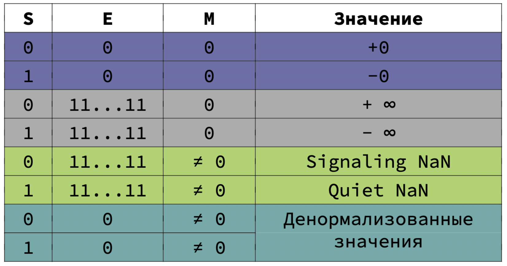

# Семинар №3
## Целочисленная и вещественная арифметика

---

Основная часть семинара проходит в виде разбора небольших сниппетов кода.  
Рекомендую ознакомиться с [официальным ридингом курса](https://github.com/victor-yacovlev/mipt-diht-caos/tree/master/practice/math).

### Задачи

 1. Получите из числа `a` `i`-ый бит
 2. Выставьте в целом числе `a` `i`-ый бит
 3. Занулите в целом числе `a` `i`-ый бит
 4. Инвертируйте в целом числе `a` `i`-ый бит
 5. Получите биты числа `a` с `i` по `j` невключительно как беззнаковое число

[Ссылка](https://interview.cups.online/live-coding/?room=1d57eb84-2429-4e16-b0ad-e0fc3809297b) на комнату для 
решения мини-задачек.

### Особые значение вещественных чисел

