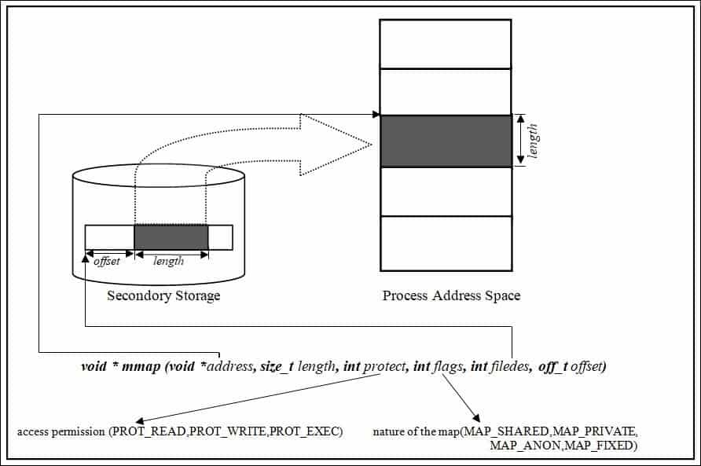

# Семинар №11
## Инструментирование в Linux и отображение файлов в память

---

### Инструментирование в Linux

Существует ряд инструментов для извлечения информации о работающей программе и/или вмешательство в ее работу. 
Известный вам пример - `gdb`.

Из курса ТП вам известна классификация инструментов для отладки:
 * статический - прям в коде: счетчики, метрики (например, `sanitisers`)
   * computational overhead
   * memory overhead
   * functional variety
 * динамический - над кодом (например, `gdb`, `strace`, `valgrind`, `perf`, `eBPF`)
   * динамически можно выбирать, на что смотреть
   
Разные подходы к инструментированию:
 * трейсинг - обрабатывать/проксировать разного рода события (например, `strace`)
 * cемплинг - условно смотреть состояние системы 100 раз в секунду (например, `perf`)

Можно повторить по семинарам прошлого года:

[Ридинг по инструментированию](https://github.com/MVCionOld/mipt-diht-tp-2021-seminars/tree/master/seminar-05/debug-gc)  
[Примеры из ридинга](https://github.com/MVCionOld/mipt-diht-tp-2021-seminars/tree/master/seminar-05/debug-gc/src)

---

### Системный вызов mmap

```
#include <sys/mman.h>

void *mmap(
    void *addr,    /* рекомендуемый адрес отображения */
    size_t length, /* размер отображения */
    int prot,      /* аттрибуты доступа */
    int flags,     /* флаги совместного отображения */
    int fd,        /* файловый декскриптор фала */
    off_t offset   /* смещение относительно начала файла */
  );

int munmap(void *addr, size_t length) /* освободить отображение */
```



Системный вызов `mmap` предназначен для создания в виртуальном адресном пространстве процесса доступной области по определенному адресу. Эта область может быть как связана с определенным файлом (ранее открытым), так и располагаться в оперативной памяти. Второй способ использования обычно реализуется в функциях `malloc`/`calloc`.

Память можно выделять только постранично. Для большинства архитектур размер одной страницы равен 4Кб, хотя процессоры архитектуры x86_64 поддерживают страницы большего размера: 2Мб и 1Гб.

В общем случае, никогда нельзя полагаться на то, что размер страницы равен 4096 байт. Его можно узнать с помощью команды `getconf` или функции `sysconf`:

```
# Bash
> getconf PAGE_SIZE
4096

/* Си */
#include <unistd.h>
long page_size = sysconf(_SC_PAGE_SIZE);
```

Параметр `offset` (если используется файл) обязан быть кратным размеру страницы; параметр `length` - нет, но ядро системы округляет это значение до размера страницы в большую сторону. Параметр `addr` (рекомендуемый адрес) может быть равным `NULL`, - в этом случае ядро само назначает адрес в виртуальном адресном пространстве.

При использовании отображения на файл, параметр `length` имеет значение длины отображаемых данных; в случае, если размер файла меньше размера страницы, или отображается его последний небольшой фрагмент, то оставшаяся часть страницы заполняется нулями.

Страницы памяти могут флаги аттрибутов доступа:
* чтение `PROT_READ`;
* запись `PROT_WRITE`;
* выполнение `PROT_EXE`;
* ничего `PROT_NONE` // как Вы думаете зачем этот флаг???

В случае использования отображения на файл, он должен быть открыт на чтение или запись в соответствии с требуемыми аттрибутами доступа.

Флаги `mmap`:
* `MAP_FIXED` - требует, чтобы память была выделена по указаному в первом аргументе адресу; без этого флага ядро может выбрать адрес, наиболее близкий к указанному.
* `MAP_ANONYMOUS` - выделить страницы в оперативной памяти, а не связать с файлом (синоним `MAP_ANON`).
* `MAP_SHARED` - выделить страницы, разделяемые с другими процессами; в случае с отображением на файл - синхронизировать изменения так, чтобы они были доступны другим процессам.
* `MAP_PRIVATE` - в противоположность `MAP_SHARED`, не делать отображение доступным другим процессам. В случае отображения на файл, он доступен для чтения, а созданные процессом изменения, в файл не сохраняются.
* `MAP_FILE` - используется маппинга файла, используется по умолчанию.

Возвращаемое значение:
```shell
RETURN VALUES
     Upon successful completion, mmap() returns a pointer to the mapped region.  Otherwise, a value of MAP_FAILED is returned and errno is set to indicate the error.
```

Синхронизацию памяти из mmap можно с помощью системого вызова `msync`.