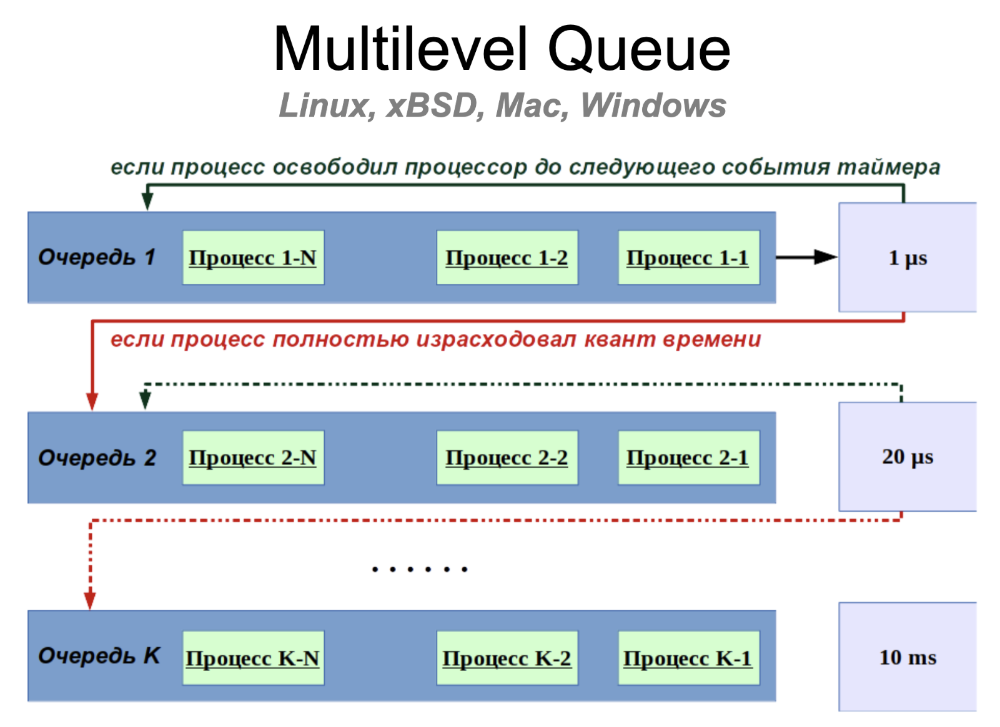

# Семинар №12
## Процессы в UNIX-системах

---

### Понятие процесса

В UNIX-системах поддерживается многозадачность, которая обеспечивается: параллельным выполнением нескольких задач, 
изоляцией адресного пространства каждой задачи.  
Верхнеуровнево процесс можно воспринимать как отдельная программа. В действительности процесс в ядре представляется 
просто как структура с множеством полей (определение структуры можно прочитать [здесь](http://lxr.linux.no/linux/include/linux/sched.h#L520)).  
Для нас, как для разработчиков на С, процесс определяется своими аттрибутами:
 * набор регистров;
 * виртуальное адресное пространство начиная с `0x00000000`;
 * идентификатор процесса (pid);
 * открытые файловые дескрипторы (fd);
 * обработчики сигналов (signal handler);
 * корневая директория;
 * текущий рабочий каталог (cwd);
 * переменные окружения (environ);
 * лимиты;
 * идентификатора пользователя и группы;
 * код возврата, если процесс завершил работу и нами было обработано это завершение;
 * состояние.

### Состояние процесса

Не вникая в особые подробности, состояния процесса бывают следующие:
 * работает (Running);
 * приостановлен до возникновения определенного события (Suspended);
 * приостановлен до явного сигнала о том, что нужно продолжить работу (sTopped);
 * более не функционирует, не занимает память, но при этом не удален из таблицы процессов (Zombie).


Более подробно про возможные состояния процесса лучше читать в man'e `man ps`:
```shell
     state     The state is given by a sequence of characters, for example,
               ``RWNA''.  The first character indicates the run state of the
               process:

               I       Marks a process that is idle (sleeping for longer than
                       about 20 seconds).
               R       Marks a runnable process.
               S       Marks a process that is sleeping for less than about 20
                       seconds.
               T       Marks a stopped process.
               U       Marks a process in uninterruptible wait.
               Z       Marks a dead process (a ``zombie'').

               Additional characters after these, if any, indicate additional
               state information:

               +       The process is in the foreground process group of its
                       control terminal.
               <       The process has raised CPU scheduling priority.
               >       The process has specified a soft limit on memory
                       requirements and is currently exceeding that limit;
                       such a process is (necessarily) not swapped.
               A       the process has asked for random page replacement
                       (VA_ANOM, from vadvise(2), for example, lisp(1) in a
                       garbage collect).
               E       The process is trying to exit.
               L       The process has pages locked in core (for example, for
                       raw I/O).
               N       The process has reduced CPU scheduling priority (see
                       setpriority(2)).
               S       The process has asked for FIFO page replacement
                       (VA_SEQL, from vadvise(2), for example, a large image
                       processing program using virtual memory to sequentially
                       address voluminous data).
               s       The process is a session leader.
               V       The process is suspended during a vfork(2).
               W       The process is swapped out.
               X       The process is being traced or debugged.
```

### Порождение процессов

Создание нового процесса осуществляется с помощью системного вызова `fork`, который создаёт почти точную копию текущего процесса, причём оба процесса продолжают своё выполнение со следующей, после вызова `fork`, инструкции. Различить родительский процесс от его копии - дочернего процесса, можно по возвращаемому значению `fork`: для родительского процесса возвращается `PID` вновь созданного процесса, а для дочернего - число `0`.

```c
pid_t pid;
if (0 < (pid = fork())) {
    /* DO SOME PARENT STUFF */
} else if (0 == pid) {
    /* DO SOME CHILD STUFF */
} else {
    perror("fork");
}
```

### Отличие дочернего процесса от родительского

Между дочерним и родительским процессами существуют различия:
 * PID дочернего отличен от PID родителя;
 * дочерний получает собственную таблицу файловых дескрипторов, являющуюся копией таблицы родителя;
   на момент вызова `fork()` (это означает, что открытые файлы наследуются, но если процесс-потомок, например, закроет 
   какой-либо файл, то это не повлияет на таблицу дескрипторов процесса-родителя);
 * для дочернего очищаются все ожидающие доставки сигналы;
 * временная статистика выполнения дочернего в таблицах ОС обнуляется;
 * блокировки памяти и записи, установленные в процессе-родителе, не наследуются;
 * текущая и корневая директории наследуются, но могут меняться независимо;
 * соединение с дебаггером (если кто-то наш процесс ptrace'ит, то он, по умолчанию, не будет ptrace'ить наших детей).

### Завершение процесса

Любой процесс, при добровольном завершении работы, должен явным образом сообщить об этом системе с помощью 
системного вызова `_exit`.

При написании программ на языках Си или С++ этот системный вызов выполняется после завершения работы функции `main`, вызванной из функции `_start`, которая неявным образом генерируется компилятором.

Обратите внимание, что в стандартной библиотеке языка Си уже существует одноименная функция `exit`, поэтому название Си-оболочки для системного вызова начинается с символа подчеркивания: `_exit`.

Функция `exit` отличается от системного вызова `_exit` тем, что предварительно сбрасывает содержимое буферов вывода, а также последовательно вызывает все функции, зарегистрированные с помощью `atexit`.

В качестве аргумента принимается целое число, -- код возврата из программы. Несмотря на то, что код возврата 
является 32-разрядным, к нему применяется операция поразрядного "и" с маской `0xFF`. Таким образом, диапазон кодов возврата находится от 0 до 255.

Код возврата предназначен для того, чтобы сообщить родительскому процессу причину завершения своей работы.

### Процессы-зомби

Сразу после того, как процесс завершился (неважно, корректно или нет), ядро записывает информацию о том, как завершился процесс и переводит его в состояние «зомби». Иными словами, зомби — это завершившийся процесс, но память о нём всё ещё хранится в ядре.
Более того, это второе состояние, в котором процесс может смело игнорировать сигнал `SIGKILL`.

### Получение информации о завершении процесса

Код возврата и причина завершения процесса всё ещё хранится в ядре и её нужно оттуда забрать. Для этого можно 
воспользоваться соответствующими системными вызовами из семейства системных вызовов `wait*`, предназначенного для 
ожидания завершения работы процесса, и получения информации о том, как процесс жил и умер.

 * `wait(int *wstatus)` - ожидание завершения любого дочернего процесса, возвращает информацию о завершении работы;
 * `waitpid(pid_t pid, int *wstatus, int options)` - ожидание (возможно неблокирующее) завершения работы конкретного 
   процесса, возвращает информации о завершении работы;
 * `wait3(int *wstatus, int options, struct rusage *rusage)` - ожидание (возможно неблокирующее) завершения любого 
   дочернего процесса, возвращает информацию о завершении работы и статистике использования ресурсов;
 * `wait4(pid_t pid, int *wstatus, int options, struct rusage *rusage)` - ожидание (возможно неблокирующее) завершения 
   конкретного процесса, возвращает информацию о завершении работы и статистике использования ресурсов.

Если в программе предусмотрено создание более одного дочернего процесса, то использовать системные вызовы `wait` и `wait3` настоятельно не рекомендуется, поскольку дочерние процессы могут завершать свою работу произвольным образом, и это может привести к неоднозначному поведению. Вместо них нужно использовать `waitpid` или `wait4`.

Состояние возврата, которое можно прочитать из таблицы процессов после того, как процесс перестал функционировать, -- 
это причина завершения работы, код возврата, если процесс завершился через `_exit`, или номер убившего его сигнала, 
если процесс был принудительно завершён. Это состояние закодировано в 32-битном значении, формат которого строго не определен стандартом POSIX. 
Для извлечения информации используется нaбор макросов:
 * `WIFEXITED(wstatus)` - возвращает значение, отличное от 0, если процесс был завершен с помощью системного вызова `_exit`;
 * `WIFSIGNALED(wstatus)` - возвращает значение, отличное от 0, если процесс был завершен принудительно;
 * `WEXITSTATUS(wstatus)` - выделяет код возврата в диапазоне от 0 до 255;
 * `WTERMSIG(wstatus)` - выделяет номер сигнала, если процесс был завершён принудительно.

Чтение кода возврата, -- это не право, а обязанность родительского процесса. В противном случае дочерний процесс, 
который завершил свою работу, становится процессом-зомби, информация о завершении которого продолжает занимать место в таблице процессов.
Множество доступных PID является ограниченным, и его исчерпание проводит к невозможности создания нового процесса (что является механизмом действия форк-бомбы).

Завершение работы родительского процесса при работающих дочерних приводит к тому, что код возврата будет прочитан процессом с `PID=1`,
который автоматически становится родительским для "осиротевших" процессов. 

### Fork-бомба

Ситуация, когда `fork()` возвращает значение -1, как правило, означает, что система исчерпала допустимый лимит ресурсов 
на создание новых процессов.

Пример реализации форк-бомбы, назначение которой - исчерпать лимит на количество запущенных процессов:

```c
#include <sched.h>
#include <stdio.h>
#include <stdlib.h>
#include <string.h>
#include <sys/types.h>
#include <unistd.h>

int main() {
    char * are_you_sure = getenv("ALLOW_FORK_BOMB");
    if (!are_you_sure || 0 != strcmp(are_you_sure, "yes")) {
        fprintf(stderr, "Fork bomb not allowed!\n");
        exit(127);
    }

    pid_t pid;
    do {
        pid = fork();
    } while (-1 != pid);

    printf("Process %d reached out limit on processes\n", getpid());
    while (1) {
        sched_yield(); // переносит текущий процесс в конец очереди на выполнения
    }
}
```

Реализация fork-бомбы из shell'a:
```shell
shell> :(){ :|:& };:
```

### Иерархия процессов

Между процессами существуют родственные связи "предок-потомок", таким образом, иерархия процессов представляет собой древовидную структуру. 
Корнем дерева процессов является процесс с `PID=1`, который называется `init` (в классических UNIX-системах, в том 
числе xBSD или консервативных Linux-дистрибутивах), либо `systemd`.

Почитать про `init` и `systemd` можно на [Хабре](https://habr.com/ru/post/503816/).

Родительские процессы могут завершаться раньше, чем завершаются их потомки. В этом случае осиротевшие процессы становятся прямыми потомками процесса с `PID=1`, то есть `init` или `systemd`.

Процессы можно объединять в группы процессов (`process group`), -- множества процессов, которым доставляются сигналы о 
некоторых событиях. Например, в одну группу могут объединяться все процессы, запущенные из одной вкладки приложения-терминала.

Объединение нескольких групп процессов называется сеансом (`session`). Как правило, в сеансы объединяются группы процессов в рамках одного входа пользователя в систему (их может быть несколько, например, несколько входов по ssh).

### Copy-On-Write

The idea behind a copy-on-write is that when a parent process creates a child process then both of these processes initially will share the same pages in memory and these shared pages will be marked as copy-on-write which means that if any of these processes will try to modify the shared pages then only a copy of these pages will be created and the modifications will be done on the copy of pages by that process and thus not affecting the other process.

### Очереди планировщика процессов

Unix-подобные системы реализуют псевдопараллельность, поскольку количество запущенных процессов может в тысячи раз 
превышать количество физических ядер компьютера. Поэтому планировщик задач выделяет кванты процессорного времени в 
порядке некоторой очереди.




