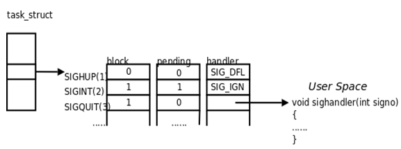
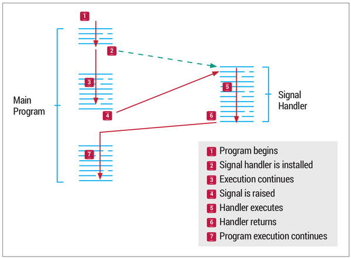
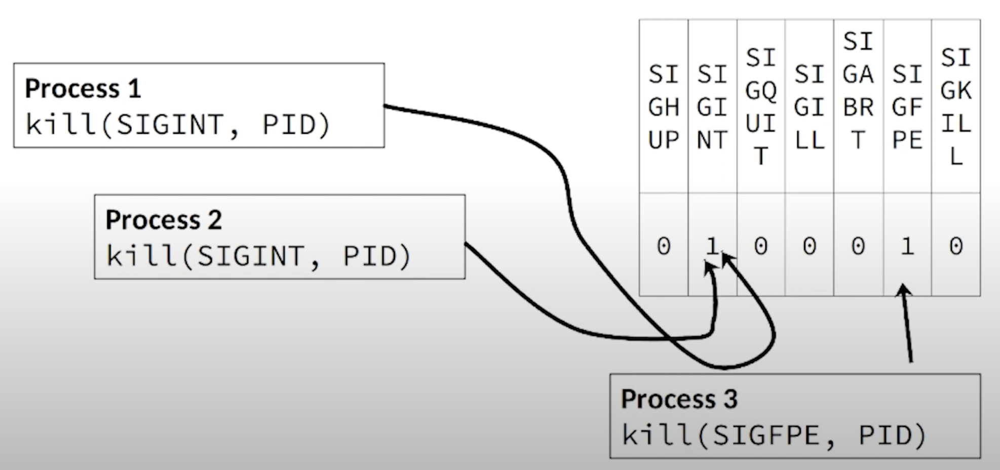

# Семинар №17
## Сигналы

[Общий ридинг, ч.1](https://github.com/victor-yacovlev/mipt-diht-caos/tree/master/practice/signal-1)  
[Общий ридинг, ч.2](https://github.com/victor-yacovlev/mipt-diht-caos/tree/master/practice/signal-2)

---
### Введение

Помимо завершения работы программы через `return` в `main`, через `_exit` или `exit`, прекращение работы может 
произойти в следствии некоторого асинхронного события.
 * `kill`
 * `killall`
 * `timeout`
 * ... 

Это все штатные ситуации и их надо учитывать. Данные команды отправляют _сигнал_ Вашему процессу.

---
### Сигналы

Сигнал - это механизм передачи коротких сообщений (номер сигнала), как правило, прерывающий работу процесса, которому он был отправлен.
Сигналы могут быть посланы процессу:
 * ядром, как правило, в случае критической ошибки выполнения;
 * другим процессом;
 * самому себе.

Номера сигналов начинаются с `1`. Значение `0` имеет специальное назначение (см. ниже про `kill`).
```shell
SYNOPSIS
     #include <signal.h>

     int
     kill(pid_t pid, int sig);

DESCRIPTION
     The kill() function sends the signal specified by sig to pid, a process or a group of processes.  Typically, Sig will be one of the signals specified in sigaction(2).  A
     value of 0, however, will cause error checking to be performed (with no signal being sent).  This can be used to check the validity of pid.
```
Некоторым номерам 
сигналов соответствуют стандартные для POSIX названия и назначения, которые подробно описаны `man 7 signal`:
```bash
     No    Name         Default Action       Description
     1     SIGHUP       terminate process    terminal line hangup
     2     SIGINT       terminate process    interrupt program
     3     SIGQUIT      create core image    quit program
     4     SIGILL       create core image    illegal instruction
     5     SIGTRAP      create core image    trace trap
     6     SIGABRT      create core image    abort program (formerly SIGIOT)
     7     SIGEMT       create core image    emulate instruction executed
     8     SIGFPE       create core image    floating-point exception
     9     SIGKILL      terminate process    kill program
     10    SIGBUS       create core image    bus error
     11    SIGSEGV      create core image    segmentation violation
     12    SIGSYS       create core image    non-existent system call invoked
     13    SIGPIPE      terminate process    write on a pipe with no reader
     14    SIGALRM      terminate process    real-time timer expired
     15    SIGTERM      terminate process    software termination signal
     16    SIGURG       discard signal       urgent condition present on socket
     17    SIGSTOP      stop process         stop (cannot be caught or ignored)
     18    SIGTSTP      stop process         stop signal generated from keyboard
     19    SIGCONT      discard signal       continue after stop
     20    SIGCHLD      discard signal       child status has changed
     21    SIGTTIN      stop process         background read attempted from control terminal
     22    SIGTTOU      stop process         background write attempted to control terminal
     23    SIGIO        discard signal       I/O is possible on a descriptor (see fcntl(2))
     24    SIGXCPU      terminate process    cpu time limit exceeded (see setrlimit(2))
     25    SIGXFSZ      terminate process    file size limit exceeded (see setrlimit(2))
     26    SIGVTALRM    terminate process    virtual time alarm (see setitimer(2))
     27    SIGPROF      terminate process    profiling timer alarm (see setitimer(2))
     28    SIGWINCH     discard signal       Window size change
     29    SIGINFO      discard signal       status request from keyboard
     30    SIGUSR1      terminate process    User defined signal 1
     31    SIGUSR2      terminate process    User defined signal 2
```

При получении сигнала процесс может:
 * Игнорировать его. Это возможно для всех сигналов, кроме `SIGSTOP` и `SIGKILL`.
 * Обработать отдельной функцией. Кроме `SIGSTOP` и `SIGKILL`.
 * Выполнить действие по умолчанию, предусмотренное назначением стандартного сигнала POSIX. Как правило, это 
   завершение работы процесса или, например, изменить состояние `Running -> sTopped`.

Сигналы, которые можно послать из терминала запущенной программе:
 * `Ctrl-C` посылает `SIGINT` (от interrupt), обычное действие - завершение программы.
 * Ctrl-\ посылает` SIGQUIT`, обычное действие - завершение с дампом памяти. В целом срабатывает чаще чем `Ctrl-C`.
 * `Ctrl-Z` посылает `SIGTSTP`, обычное действие - остановка процесса. То есть как `SIGSTOP`.

Другие полезные сигналы:
 * `SIGKILL` - безусловное убиение процесса.
 * `SIGSTOP` - безусловная остановка программы.
 * `SIGCONT` - продолжение выполнения (отмена `SIGSTOP`)

_Как убить неубиваемое? (или как выйти из vim)_

`killall -9 vim` или `ps aux | grep vim`, а потом уже `kill -9 <selected_pid>`. Надо заметить, что `-9` лучше писать как
`-SIGKILL`, но это длиннее, так что на конкретной платформе в интерактивном режиме проще писать `-9`. А `-SIGKILL` 
оставить для переносимых приложений.

---
### Сигналы с точки зрения OS

Когда одна программу отправляет сигнал другой, то этот сигнал записывается в атрибуты программы получателя. Если это 
обычный сигнал, то проставится бит в маске ожидающих доставки сигналов (__SigPnd__), если сигнал реального времени, то 
запишется в очередь сигналов.

Сама программа-получатель из своего кода не взаимодействует с маской ожидающих сигналов или очередью сигналов. С ними 
взаимодействует ядро системы. Оно же обрабатывает (или не обрабатывает, если доставка сигналов заблокирована __SigBlk__) 
эти сигналы либо действиями по умолчанию, либо игнорированием (__SigIgn__), либо останавливая выполнение программы в 
произвольный для нее момент и вызывая в ней обработчик сигнала в отдельном контексте (на отдельном стеке вызовов 
функций).



Отсюда вытекает требование к **асинхронной безопасности** обработчиков сигналов. Например, если основная программа 
может 
быть прервана на обработку сигнала в момент вызова `printf`, и в обработчике тоже используется эта функция, то есть 
шанс, что в вас все взорвется (испортится глобальный стейт функции `printf` и, возможно, еще что-то) или намертво 
зависнет (если в основной программе был взят lock, и теперь снова пытается взяться уже из обработчика сигнала).



---
### signal

Сигналы, которые можно перехватить, то есть все, кроме `SIGSTOP` и `SIGKILL`, можно обработать программным способом. Для 
этого необходимо зарегистрировать функцию-обработчик сигнала.

```c
#include <signal.h>

// Этот тип определен только в Linux!
typedef void (*sighandler_t)(int);

sighandler_t signal(int signum, sighandler_t handler); // для Linux
void (*signal(int signum, void (*func)(int))) (int);   // по стандарту POSIX
```

Системный вызов `signal` предназначен для того, чтобы зарегистрировать функцию в качестве обработчика определенного сигнала. Первым аргументом является номер сигнала, вторым - указатель на функцию, которая принимает единственный аргумент - номер пришедшего сигнала (т.е. одну функцию можно использовать сразу для нескольких сигналов), и ничего не возвращает.

Два специальных значения функции-обработчика `SIG_DFL` и `SIG_IGN` предназначены для указания обработчика по 
умолчанию (т.е. отмены ранее зарегистрированного обработчика) и установки игнорирования сигнала.

Системный вызов `signal` возвращает указатель на ранее установленный обработчик.

В стандартах, родоначальниками которых были UNIX System-V и BSD UNIX, используется различное поведение обработчика 
сигнала, зарегистрированного с помощью `signal`. При определении одного из макросов препроцессора: `_BSD_SOURCE`, 
`_GNU_SOURCE` или `_DEFAULT_SOURCE` (что подразумевается опцией компиляции `-std=gnu99` или `-std=gnu11`), используется 
семантика BSD; в противном случае (`-std=c99` или `-std=c11`) - семантика System-V.

Отличия BSD от System-V:

 * В System-V обработчик сигнала выполняется один раз, после чего сбрасывается к обработчику по умолчанию, а в BSD - 
остается неизменным.
 * В BSD обработчик сигнала не будет вызван, если в это время уже выполняется обработчик того же самого сигнала, а в 
   System-V это возможно.
 * В System-V блокирующие системные вызовы (например, read) завершают свою работу при поступлении сигнала, а в BSD 
   большинство блокирующих системных вызовов возобновляют свою работу после того, как обработчик сигнала завершает 
   свою работу.

По этой причине, системный вызов `signal` считается устаревшим, и в новом коде использовать его запрещено, за 
исключением двух ситуаций:
```c
signal(signum, SIG_DFL); // сброс к обработчику по умолчанию
signal(signum, SIG_IGN); // игнорирование сигнала
```

---
### sigaction

Системный вызов `sigaction`, в отличие от `signal`, в качестве второго аргумента принимает не указатель на функцию, а 
указатель на структуру `struct sigaction`, с которой, помимо указателя на функцию, хранится дополнительная информация, 
описывающая семантику обработки сигнала. Поведение обработчиков, зарегистрированных с помощью `sigaction`, не зависит от 
операционной системы.

```c
int sigaction(int signum, const struct sigaction *restrict act, struct sigaction *oldact);
```

Третьим аргументов является указатель на структуру, описывающую обработчик, который был зарегистрирован для этого. Если
эта информация не нужна, то можно передать значение `NULL`.

Основные поля структуры `struct sigaction`:

```c
struct sigaction {
   void     (*sa_handler)(int);
   void     (*sa_sigaction)(int, siginfo_t *, void *);
   sigset_t   sa_mask;
   int        sa_flags;
   void     (*sa_restorer)(void);
};
```

 * `sa_handler` - указатель на функцию-обработчик с одним аргументом типа `int`, могут быть использованы значения 
   `SIG_DFL` и `SIG_IGN`;
 * `sa_flags` - набор флагов, описывающих поведение обработчика;
 * `sa_sigaction` - указатель на функцию-обработчик с тремя параметрами, а не одним (используется, если в флагах 
   присутствует `SA_SIGINFO`).

Некоторые флаги, которые можно передавать в `sa_flags`:

 * `SA_RESTART` - продолжать выполнение прерванных системных вызовов (семантика BSD) после завершения обработки сигнала. 
   По умолчанию (если флаг отсутствует) используется семантика System-V.
 * `SA_SIGINFO` - вместо функции из `sa_handler` нужно использовать функцию с тремя параметрами `int signum, siginfo_t 
   *info, void *context`, которой помимо номера сигнала, передается дополнительная информация (например PID 
   отправителя) и пользовательский контекст.
 * `SA_RESETHAND` - после выполнения обработчика сбросить к обработчику по умолчанию (семантика System-V). По умолчанию 
   (если флаг отсутствует) используется семантика BSD.
 * `SA_NODEFER` - при повторном приходе сигнала во время выполнения обработчика он будет обработан немедленно 
   (семантика System-V). По умолчанию (если флаг отсутствует) используется семантика BSD.

---
### sigprocmask

Множества сигналов описываются типом данных `sigset_t`, объявленным в заголовочном файле `<signal.h>`.  
Операции над множествами:
 * `sigemptyset(sigset_t *set)` - инициализировать пустое множество;
 * `sigfillset(sigset_t *set)` - инициализировать полное множество;
 * `sigaddset(sigset_t *set, int signum)` - добавить сигнал к множеству;
 * `sigdelset(sigset_t *set, int signum)` - убрать сигнал из множества;
 * `sigismember(sigset_t *set, int signum)` - проверить наличие сигнала в множестве.

Временная блокировка доставки сигналов часто используется для защиты критических секций программы, когда внезапное 
выполнение обработчика может повредить целостности данных или нарушению логики поведения.

При этом, нельзя заблокировать сигналы `SIGSTOP` и `SIGKILL`.

Блокировка реализуется установки маски блокируемых сигналов с помощью системного вызова `sigprocmask`:

```c
int sigprocmask(int how, sigset_t *set, sigset_t *old_set);
```
где `old_set` - куда записать старую маску (может быть `NULL`, если неинтересно), а параметр `how` - это одно из значений:
 * `SIG_SETMASK` - установить множество сигналов в качестве маски блокируемых сигналов;
 * `SIG_BLOCK` - добавить множество к маске блокируемых сигналов;
 * `SIG_UNBLOCK` - убрать множество из маски блокируемых сигналов.

Сигналы, которые попали в маску сигналов, ожидающих доставки, остаются там до тех пор, пока не будут доставлены (а в 
дальнейшем - либо игнорированы, либо обработаны). Если сигнал был заблокирован, то его обработчик будет вызван сразу 
после разблокировки.

---
### sigsuspend

Системный вызов ```sigsuspend(sigset_t *temp_mask)``` временно приостанавливает работу программы до тех пор, пока не 
придет один из сигналов, отсутствующий в множестве `temp_mask`. Сигналы, отсутствующие в новом временном множестве, 
будут доставлены даже в том случае, если они ранее были заблокированы.

Сразу после завершения работы `sigsuspend`, маска заблокированных сигналов вернется в исходную.

---
### Сигналы реального времени



Сигналы реального времени - это расширение POSIX, которые, в отличие от стандартных UNIX-сигналов могут быть обработаны используя очередь доставки, и таким образом:
 * учитывается их количество и порядок прихода;
 * вместе с сигналом сохраняется дополнительная метаинформация, включая одно целочисленное поле, которое может быть 
   использовано произвольным образом.

Сигналы реального времени задаются значениями от `SIGRTMIN` до `SIGRTMAX`, и могут быть использованы с помощью `kill` как 
дополнительные стандартные UNIX-сигналы. Действие по умолчанию аналогично `SIGTERM`.

Для использования очереди сигналов, необходимо отправлять их с помощью функции `sigqueue`:
```c
#include <signal.h>
union sigval {
   int    sival_int;
   void*  sival_ptr;
};
int sigqueue(pid_t pid, int signum, const union sigval value);
```

Эта функция может завершиться с ошибкой `EAGAIN` в том случае, если исчерпан лимит на количество сигналов в очереди. 
Опциональное значение, передаваемое в качестве третьего параметра, может быть извлечено получателем из поля 
`si_value` структуры `siginfo_t`, если использовать вариант обработчика `sigaction` с тремя аргументами.

Помимо ожидания сигнала с последующим вызовом обработчика (`sigsuspend`), также можно ожидать сигнал, но не вызвать 
обработчик этого сигнала, а сохранить всю информацию об отправленном сигнале: номер сигнала, передаваемое значение, 
процесс и тд. Для этого есть функция `sigwaitinfo` и ее модификация `sigtimedwait`.

```c
 #include <signal.h>

 int sigwaitinfo(const sigset_t *restrict set,
                 siginfo_t *restrict info);

 int sigtimedwait(const sigset_t *restrict set,
                  siginfo_t *restrict info,
                  const struct timespec *restrict timeout);

typedef struct {
   int   si_signo;           // Signal number being delivered. This field is always set.
   int   si_code;            // Signal code. This field is always set. Refer to https://www.mkssoftware.com/docs/man5/siginfo_t.5.asp#Signal_Codes
   union sigval si_value;    // Signal value.
   int   si_errno;           // If non-zero, an errno value associated with this signal.
   pid_t si_pid;             // Process ID of sending process.
   uid_t si_uid;             // Real user ID of sending process.
   void* si_addr;            // Address at which fault occurred.
   int   si_status;          // Exit value or signal for process termination.
   int   si_band;            // Time of last data modification.
} siginfo_t;

typedef struct {
   long    tv_sec;           // seconds
   long    tv_nsec;          // nanoseconds
} timespec;
```

---
### signaldf (Linux specific)

Представьте, что информацию, поступающую о приходящих сигналах, можно получить путем чтения из особенного пайпа.
Для этого в Linux есть специальная функция `signalfd`:

```c

#include <sys/signalfd.h>

int signalfd(int fd, const sigset_t *mask, int flags);

struct signalfd_siginfo {
   uint32_t ssi_signo;    /* Signal number */
   int32_t  ssi_errno;    /* Error number (unused) */
   int32_t  ssi_code;     /* Signal code */
   uint32_t ssi_pid;      /* PID of sender */
   uint32_t ssi_uid;      /* Real UID of sender */
   int32_t  ssi_fd;       /* File descriptor (SIGIO) */
   uint32_t ssi_tid;      /* Kernel timer ID (POSIX timers)
   uint32_t ssi_band;     /* Band event (SIGIO) */
   uint32_t ssi_overrun;  /* POSIX timer overrun count */
   uint32_t ssi_trapno;   /* Trap number that caused signal */
   int32_t  ssi_status;   /* Exit status or signal (SIGCHLD) */
   int32_t  ssi_int;      /* Integer sent by sigqueue(3) */
   uint64_t ssi_ptr;      /* Pointer sent by sigqueue(3) */
   uint64_t ssi_utime;    /* User CPU time consumed (SIGCHLD) */
   uint64_t ssi_stime;    /* System CPU time consumed
                             (SIGCHLD) */
   uint64_t ssi_addr;     /* Address that generated signal
                             (for hardware-generated signals) */
   uint16_t ssi_addr_lsb; /* Least significant bit of address
                             (SIGBUS; since Linux 2.6.37) */
   uint8_t  pad[X];       /* Pad size to 128 bytes (allow for
                             additional fields in the future) */
};
```

Таким образом помимо ожидания сигналов можно ожидать и другие события по нескольким файловым дескрипторам через средства
мультиплексирования (следующие семинары).

Попробуйте написать `signalfd` самостоятельно. Подсказка: для этого действительно нужен пайп.

---
### Как писать хороший код с сигналами

Бороться с этим можно несколькими способами:
 * Писать честные асинхронно-безопасные обработчики (взаимодействие с остальной частью программы только через `volatile 
sig_atomic_t` переменные и системные вызовы).
 * Использовать `sigsuspend` (чтобы обработчики могли выполняться, только пока выполняется `sigsuspend`)
* Использовать `signalfd`. С ней можно обрабатывать сигналы в контексте основного потока программы, соответственно 
  никаких требований к асинхронной безопасности. Но это linux-специфичное решение.
* Как вариант в обработчике можно писать в пайп. То есть получить некий аналог `signalfd`, только переносимый.

---
### Источники и полезные ссылки

[Практика работы с сигналами (Habr)](https://habr.com/ru/post/141206/)  
[Статья по работе с сигналами в Unix](https://www.opennet.ru/base/dev/unix_signals.txt.html)  
[Доставка сигналов во многопоточной среде](http://www.regatta.cs.msu.su/doc/usr/share/man/info/ru_RU/a_doc_lib/aixprggd/genprogc/signal_mgmt.htm)
