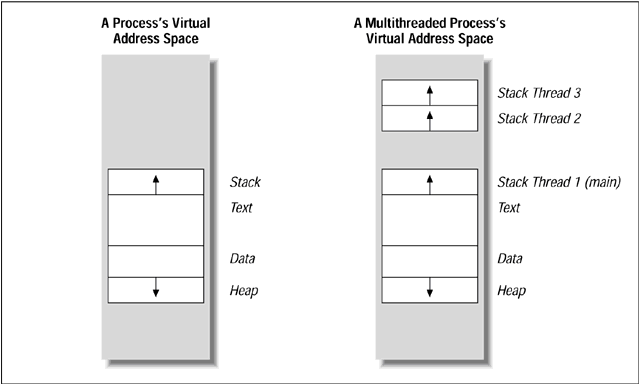
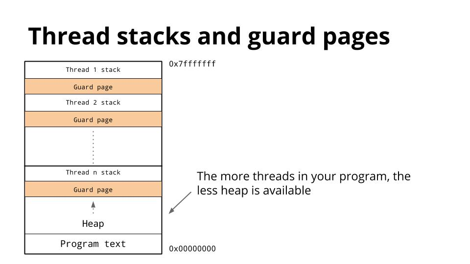

# Семинар №21
## POSIX Threads

---

### Введение

Поток (нить, легковесный процесс) - единица планирования времени в рамках одного процесса.

Все потоки в рамках одного процесса разделяют общее адресное пространство и открытые файловые дескрипторы.

Для каждого потока предусмотрен свой отдельный стек фиксированного размера, который располагается в общем адресном пространстве. 



В конце стека для каждого потока обычно присутствует небольшой участок памяти (Guad Page), предназначенный для того, чтобы предотвратить ситуацию перезаписи данных другого потока в результате, например, его переполнения.



В каждом процессе существует как минимум один поток, выполнение которого начинается с функции `_start`.

В отличие от обычных процессов, которые имеют иерархическую структуру "родитель-ребенок", все потоки являются 
равнозначными.

### POSIX Threads

Стандартом для UNIX-систем является POSIX Threads API. В системе Linux (как и во FreeBSD), ввиду фрагментации стандартной библиотеки, компоновка программ должна проводиться с опцией компилятора `-pthread`.

В отличии от большинства других функций POSIX, в случае ошибки, функции из pthread не прописывают их код в переменную `errno`, а возвращают различные целочисленные значения, отличные от `0`, которые соответствуют определенным ошибкам.


### Создание и запуск нового потока

```c++
int pthread_create(
    // указатель на переменную-результат
    pthread_t *thread,

    // опционально: параметры нового потока,
    // может быть NULL
    const pthread_attr_t *attr,

    // функция, которая будет выполняться
    (void*)(*function)(void*),

    // аргумент, который передается в функцию
    void *arg
);
```

Функция `pthread_create` создает новый поток, и сразу же запускает в нем на выполнение функцию (на самом деле начнет 
выполняться, когда планировщик операционной системы передаст ей управление), которая 
передана в качестве аргумента.

Функция возвращает `0` при успешном завершении и значение кода ошибки (положительное число) при ошибке. Возможные коды ошибок: `EAGAIN`, `EINVAL`, `EPERM`, они описаны в `<errno.h>`. Обратите внимание, переменная `errno` в случае ошибки не модифицируется.

В параметре `thread` передается указатель на переменную типа `pthread_t`, в которую будет записан идентификатор 
созданной нити. Идентификатор нити (тип `pthread_t`) - это некоторый "непрозрачный" указатель. Ему можно присваивать
значение `0`, либо его можно сравнивать на равенство или неравенство с другим идентификатором нити.

Параметр `attr` позволяет задавать атрибуты создаваемой нити, такие как размер стека, приоритет, флаги планирования 
и т.п. Если нить создается со значениями атрибутов по умолчанию, параметр `attr` может быть передан равным `NULL`. 
Ненулевой параметр `attr` может потребоваться, если нужно задать другой размер стека нити, чем по умолчанию. По 
умолчанию размер стека нити берется из ограничения на размер стека процесса (`ulimit -s` или `RLIMIT_STACK` в 
`getrlimit`). Размер стека нельзя задать менее чем минимальный поддерживаемый размер стека для данной платформы. 
Минимальный размер стека для нити можно получить с помощью вызова `sysconf(_SC_THREAD_STACK_MIN)`.

Параметр `function` - это основная функция нити. Выполняемая функция должна принимать единственный аргумент 
размером машинного слова (`void*`), и этот аргумент
передается одновременно с созданием потока. Возвращаемое значение выполняемой функции можно будет получить после её
выполнения. функция нити должна иметь вид:
```c++
void* function(void* ptr);
```
Аргумент `ptr` передается без изменений из создающей нити. В этом аргументе можно передавать указатель на структуру 
параметров нити или даже, используя преобразование типов, передавать целые числа (например, номер нити). Однако тип 
`int` и тип указателя могут иметь разные размеры. На помощь приходит либо тип `size_t`, либо тип `intptr_t`, который 
может послужить промежуточным типом для преобразования из целого числа в указатель и обратно.
Возвращаемое значение нити передается без изменений в ту нить, которая будет выполнять ожидание завершения нити.

Параметр `arg` передается в основную функцию нити без изменений, он же `ptr` из `void* function(void* ptr)`.

### Завершение работы потока и результат работы

Поток завершается в тот момент, когда завершается выполнение функции, либо пока не будет вызван аналог `exit` для потока - функция `pthread_exit`.
Нити внутри процесса не образуют иерархии "отец-сын". Любая нить может ждать завершения выполнения любой другой нити.

Возвращаемые значения размером больше одного машинного слова, которые являются результатом работы потока, не могут быть размещены в стеке, поскольку стек будет уничтожен при завершении работы функции.

Дождаться завершения потока и получить результат можно с помощью функции `pthread_join`

```c++
int pthread_join(
    // поток, который нужно ждать
    pthread_t thread,

    // указатель на результат работы функции,
    // либо NULL, если он не интересен
    (void*) *retval
);
```

Функция `pthread_join` ожидает завершения работы определенного потока, и получает результат работы функции.

Возможна ситуация, приводящая к deadlock'у, когда два потока вызывают друг для друга ожидание. Функция `pthread_join` проверяет эту ситуацию, и завершается с ошибкой (не блокируя выполнение).

```c++
pthread_t a;
pthread_t b;

void* thread_func_a(void *) {
    sleep(1);
    pthread_join(b, NULL);
}

void* thread_func_b(void *) {
    sleep(1);
    pthread_join(a, NULL);
}

// Bug: Deadlock, but detected
pthread_create(&a, NULL, thread_func_a, 0);
pthread_create(&b, NULL, thread_func_b, 0);
```

Такая проверка возможна только при попытке ожидать поток, который уже ожидает поток, пытающийся вызвать `pthread_join`. В случае нескольких потоков, которые косвенно ожидают друг друга, такая диагностика невозможна, и приведет к deadlock'у.

Нить можно ожидать только один раз. Повторная попытка ожидания нити, ожидание которой уже было выполнено, скорее всего приведет
к ошибке `"Segmentation fault"` и аварийному завершению процесса.

В библиотеке `pthread` отсутствуют функции, которые позволили бы ждать любую нить из созданных. Если возникла необходимость использования
подобной функции, необходимо пересматривать архитектуру приложения, чтобы такие ситуации исключить.

### Принудительное завершение потока

Функция `pthread_cancel` принудительно завершает работу потока, если поток явно это не запретил с помощью функции `pthread_setcancelstate`.

```c++
int pthread_cancel(
    // поток, который нужно прибить
    pthread_t thread
);
```

Результатом работы функции, который будет передан в `pthread_join` будет специальное значение `PTHREAD_CANCELED`.

В системе Linux остановка потоков реализована через отправку процессом самому себе сигнала реального времени с номером `32`.

Принудительное завершение потока вовсе не означает, что поток будет немедленно остановлен. Функция `pthread_cancel` только проставляет флаг остановки, и этот флаг может быть проверен только во время определенного набора системных вызовов и функций стандартной библиотеки, которые называются *Cancelation Points*.

Полный список функций, которые могут быть прерваны, перечислен в разделе `7` man-страницы `pthreads`.

Некоторые системы, в том числе Linux, позволяют принудительно завершить поток даже вне Cancelation Points. Для этого поток должен вызывать функцию `pthread_setcanceltype` с параметром `PTHREAD_CANCEL_ASYNCHRONOUS`. После этого завершение потока будет осуществляться на уровне планировщика заданий.

### Thread-Local Storage

Переменную, локальную для нити, можно определить с помощью

1) В C11 с помощью ключевого слова `_Thread_local`
```c
_Thread_local int count;
```

2) В C++11 [thread_local](http://en.cppreference.com/w/cpp/language/storage_duration)
```c++
thread_local int count;
```

С точки зрения программы на C или C++ это - глобальная переменная, доступная во всех функциях, находящихся в единице компиляции
ниже точки определения.

Каждая нить имеет свою копию переменных, локальных для нити. При создании нити эти переменные копируются из специальной секции исполняемого файла.
Поэтому их начальные значения будут теми, которые прописаны в исполняемом файле, а не теми, которые в момент создания были у
нити, которая выполняет `pthread_create`. Каждая нить может модифицировать свои переменные, локальные для нити. Эти изменения
не отразятся на других нитях.

Тем не менее, поскольку все нити работают в общем адресном пространства, можно передать адрес переменной, локальной для нити, в другие
нити, и другие нити смогут читать и модифицировать эту переменную.

При работе с глобальными переменными следует помнить о состояниях гонок и атомарности.

### Атрибуты потока

Атрибуты потока (второй параметрв в `pthread_create`) хранятся в структуре `pthread_attr_t`, объявление которой является платформо-зависимым, и не регламентируется стандартом POSIX.

Для инициализации атрибутов используется функция `pthread_attr_init(pthread_attr_t *attr)`, и кроме того, после использования, структуру атрибутов необходимо уничтожать с помощью `pthread_attr_destroy`.

С помощью нескольких функций-сеттеров можно задавать определенные параметры вновь создаваемого потока:

* `pthread_attr_setstacksize` - установить размер стека для потока. Размер стека должен быть кратен размеру страницы памяти (обычно 4096 байт), и для него определен минимальный размер, определяемый из параметров системы `sysconf(_SC_THREAD_STACK_MIN)` или константой `PTHREAD_STACK_MIN` из `<limits.h>` (в Linux это 16384 байт);
* `pthread_attr_setstackaddr` - указать явным образом адрес размещения памяти, которая будет использована для стека;
* `pthread_attr_setguardsize` - установить размер защитной области после стека (Guard Page). По умолчанию в Linux этот размер равен размеру страницы памяти, но можно явно указать значение 0.

### Максимальное количество потоков и процессов

[Ссылка](https://unix.stackexchange.com/questions/47595/linux-max-threads-count) - про максимальное количество 
процессов и 
потоков в системе.

### Про обработку сигналов

[Ссылка](https://stackoverflow.com/questions/11679568/signal-handling-with-multiple-threads-in-linux) - статья на тему 
потоков и сигналов.  
**TL;DR**: обработчик вызывается в произвольном потоке, из тех, где сигнал не заблокирован. То есть для лучшей 
предсказуемости сигналы стоит изначально заблокировать еще до создания дополнительных потоков, а затем создать отдельный поток в котором их получать через `sigsuspend`/`signalfd`/`sigwaitinfo` (и только в нем они будут разблокированы).